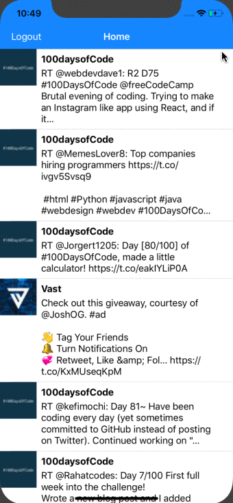

# Twitterly

*Twitter clone that allows users to view a customized feed, pull to refresh, and most importantly compose, favorite, and retweet tweets!*

## Features
- User can compose a tweet. 
- User can favorite a tweet. 
- User can retweet a tweet. 
- User sees app icon in home screen and styled launch screen.
- User can log in. 
- User can log out.
- User stays logged in across restarts. 
- User can view tweets with the user profile picture, username, and tweet text. 
- User can pull to refresh. 
- User can load past tweets infinitely. 

## Video Walkthrough

Here's a walkthrough of implemented features:

### Tweeting and Favoriting: 

### Scrolling and pull-to-refresh:

